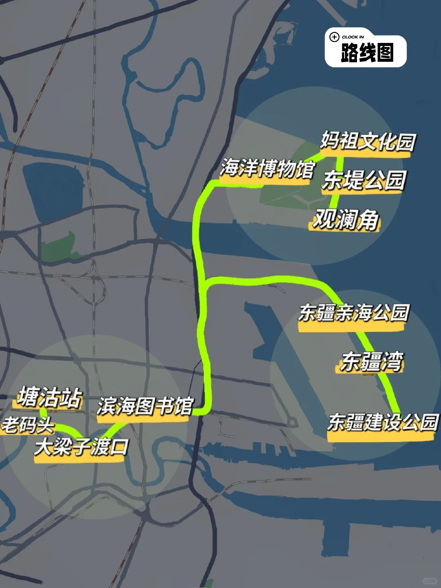

# 天津两天一夜

## Day 1：周六

- 9点半出发，自驾前往天津
- 12点半到达天津，干饭
- 14点左右导航到**河华里社区**，停车后步行到大梁子渡口，坐轮渡喂海鸥。周末15分钟一趟，到岸立即返航
- 16点左右到达**天津东疆凯莱悦享酒店**办理入住
- 17点出发，前往**东疆亲海公园**喂鸽子看日落
- 完事干饭
- 晚上自由活动

## Day 2：周日

- 6点起床，**东疆亲海公园**喂鸽子看日出
- 7点半左右回酒店吃早饭
- 9点到达**国家海洋博物馆**。11，13，14，15点有美人鱼表演，每场10分钟
- 中午干饭
- 下午回京

## 美食

参考小红书滨海新区美食

八珍豆腐、桂发祥十八街麻花-直营

